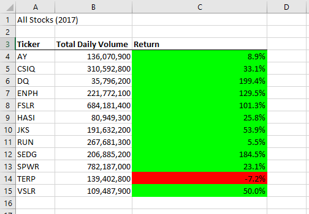
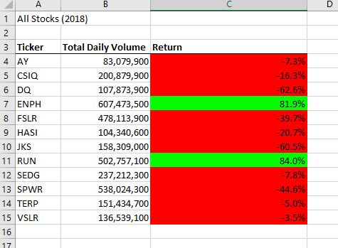
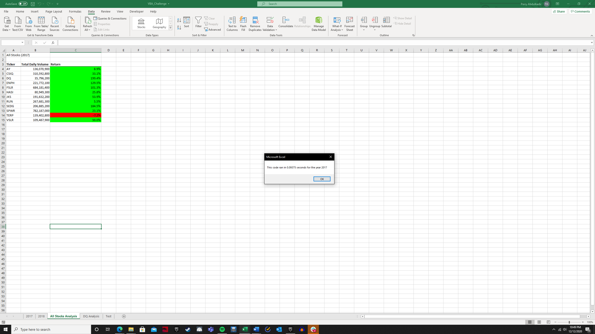
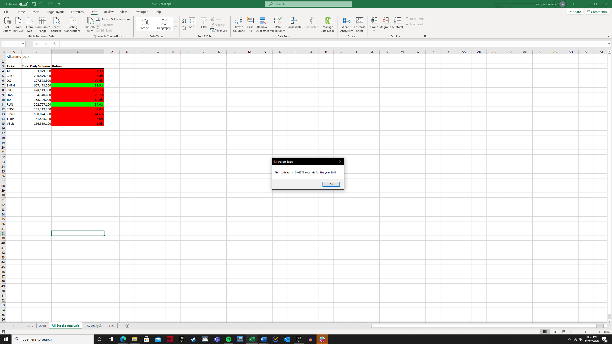

# Green Energy Stock Analysis

## Overview of Project
Steve reached out to me to help his parents select green energy stocks. I was provided an Excel spreadsheet with data for 12 different green energy stocks. This spreadsheet has one sheet for 2017 and one sheet for 2018; both sheets list the Open, High, Low, Close, and Adjusted Close prices, as well as the volume traded, for each ticker on a given trading day. This spreadsheet already had a macro that calculated total daily volume and annual return for each ticker after the user selected a year to analyze.

I was tasked with refactoring the code so it runs more quickly. Below, I go into more detail for the refactoring process and discuss the implications of the stock performance. 

## Resources
Software: VBA, Excel

## Results

### Stock performance: 2017 vs. 2018

One of the most striking aspects of the stock performance in 2017 and 2018 is the degree to which the stocks chosen are correlated. This intuitively makes sense: not only are they all subject to overall market fluctuations, but they are also likely to be highly correlated because of their shared industry. All but one stock had a positive return in 2017, and all but 2 had negative returns in 2018. 






It would be worthwhile for Steve’s parents to investigate a more diversified portfolio. Perhaps foreign indices have green energy stocks that are less correlated with the 12 selected here. It is also noteworthy that the performance of these tickers was mostly negative in 2018, a year in which the market as a whole made gains. It would be prudent to investigate whether green stocks generally sank during this period or if the poor performance were limited to this selection of 12 tickers.

### Execution times: original vs. refactored code

The refactored code diverges from the original code at first by creating the tickerIndex variable and setting it equal to 0. 

```
Dim tickerIndex As Integer
     tickerIndex = 0
```
I then created three output arrays. 

```
Dim tickerVolumes(0 To 11) As Long
Dim tickerStartingPrices(0 To 11) As Single
Dim tickerEndingPrices(0 To 11) As Single
```
Next, I created a for loop to initialize the tickerVolumes array to zero. I used this code taken [from here](https://excelmacromastery.com/excel-vba-array/#:~:text=To%20assign%20values%20to%20an%20array%20you%20use,is%20no%20location%204%20in%20the%20array%20example) to initialize a dynamic array. 

```
    For j = LBound(tickerVolumes) To UBound(tickerVolumes)
        tickerVolumes(j) = 0
        Next j
```
Next, I created a for loop to loop over all the rows in the spreadsheet. 

```
For i = 2 To RowCount
```
This code increases the volume if it is counting the current ticker: 
```
 tickerVolumes(tickerIndex) = tickerVolumes(tickerIndex) + Cells(i, 8).Value
```
And this code checks if the current row is the first or last of the selected tickerIndex. 

```
 If Cells(i, 1).Value = tickers(tickerIndex) And Cells(i - 1, 1) <> Cells(i, 1) Then

            tickerStartingPrices(tickerIndex) = Cells(i, 6)
            
        End If
        
        '3c) check if the current row is the last row with the selected ticker
         
        If Cells(i, 1).Value = tickers(tickerIndex) And Cells(i + 1, 1) <> Cells(i, 1) Then
            tickerEndingPrices(tickerIndex) = Cells(i, 6)
```
This code then increases the tickerIndex by one so that it loops through the next ticker and finally closes the for loop once all tickers have been counted. 

```
   tickerIndex = tickerIndex + 1
            
        End If
    
    Next i
```

Finally, this code outputs the Ticker, Total Daily Volume, and Return. 

```
   For i = 0 To 11
        
        Worksheets("All Stocks Analysis").Activate
        
       Cells(4 + i, 1).Value = tickers(i)
       Cells(4 + i, 2).Value = tickerVolumes(i)
       Cells(4 + i, 3).Value = tickerEndingPrices(i) / (tickerStartingPrices(i)) - 1
```

The rest of the refactored code after this relates to formatting and is identical to the original code. 
The refactored code ran more quickly than the original code. The original code calculated the results for 2017 in 0.602 seconds while the refactored code only took 0.094 seconds. Similarly, the original code took 0.594 seconds for 2018 while the refactored code took .094 seconds. 





This means that the refactored code was 6.4 times faster for 2017 and 6.3 times faster for 2018 than the original code. 
 

## Summary

### Advantages and disadvantages of refactoring code

In general, refactoring code offers numerous advantages. More efficient code can run more quickly – while the time saved in this case was trivial (about half a second), the time saved on much larger data sets can be massive. This analysis was for only 12 stocks; suppose that instead, we were conducting an analysis of all 2,800 stocks listed on the New York Stock Exchange. Assuming the calculation time increases linearly with number of stocks, that means that running the same calculation for all NYSE stocks in 2018 would take about 139 seconds using the original code and 22 seconds for the refactored code. If an end-user were recalculating multiple times, it would be a far better experience for the calculations to take 20 seconds as opposed to over 2 minutes.

The other advantage of refactoring code is that it can be made for flexible. For example, earlier versions of the original code had the years of analysis hard coded. Later, this was changed so that the end-user could choose their year of analysis. After this change, the program became far more flexible: the user could import data for other years into different sheets, and they would not have to update any code to run calculations on them. 

Finally, refactoring code can make it easier for others to work with. Intuitive spacing, indentation, and liberal use of comments can all ensure that others can easily read your code, even if you are not around to help them. 

Of course, the biggest downside to refactoring is that it requires more time. There may be some instances where code is only intended for one very specific purpose, and it would be a waste of time to spend hours making the code more flexible when it will literally never be used for any other purpose.


### Pros and cons of refactoring our original stock analysis script
In my opinion, the value of this refactoring project depends on how Steve intends to use this worksheet in the future. If he intends to use this as a template to help other clients make decisions going forward, then the time saved by refactoring will likely pay dividends. As mentioned above, if he used this sheet to analyze all stocks in the NYSE, the refactoring would save about 2 minutes per calculation. If he added other classes of positions, like foreign indices, commodities, etc., then the refactoring could potentially save many minutes or even hours per calculation. If he uses this worksheet for other clients going forward, he will also benefit from more intuitive code in case he at some point decides he needs to update the worksheet. 

If, however, he uses this worksheet as a one-and-done to help his parents analyze 12 green energy stocks, the refactoring is a waste of time. Even if used many times, no more than a few seconds would ever be saved by the end-user at the expense of several hours of programming. Furthermore, if he only intends to use the worksheet for this very narrow purpose, it is less critical that the code be flexible and intuitive to edit. 

 

-----

### **Contact:**

**Email:** perry.abdulkadir@alumni.harvard.edu

**Linkedin:** https://www.linkedin.com/in/perry-abdulkadir-6a255199/


